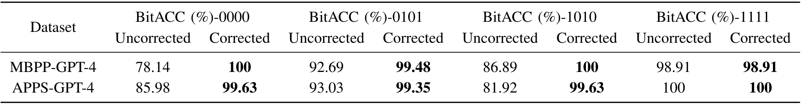

<p align="center">
     <a href="https://arxiv.org/abs/2402.07518">

     </a>
   <p align="center">
    <a><strong>Boquan Li<sup>1,2</sup></strong></a>
    .
    <a><strong>Zirui Fu<sup>1</sup></strong></a>
    .
    <a><strong>Mengdi Zhang<sup>2</sup></strong></a>
    .
    <a><strong>Peixin Zhang<sup>2</sup></strong></a>
    .
    <a><strong>Jun Sun<sup>2</sup></strong></a>
    .
    <a><strong>Xingmei Wang<sup>1</sup></strong></a>
   
    
<p align="center">
    <strong><sup>1</sup>Harbin Engineering University</strong> &nbsp;
    <strong><sup>2</sup>Singapore Management University</strong> &nbsp;
<p align="center">
    <a href='https://arxiv.org/abs/2402.07518'>
      
         </a>
  

# ACW : AI-Generated Code Watermarking  <a id="acw"></a>

We propose a plug-and-play watermarking approach for AI-generated code detection, named ACW (AI Code Watermarking). 
ACW effectively detects AI-generated code, preserves code utility, and is resilient against common code optimizations. 
Especially, ACW is efficient and is universal across different LLMs, addressing the limitations of existing approaches.

If you discover any defect or have any suggestions for this work, please feel free to submit a [pull request](https://github.com/flyingby/Awesome-Deepfake-Generation-and-Detection/issues) or [contact us](#contact).


</p>


## Overview of this repository

- [Appendix](#appendix)
    - [Transformation Rules](#transformation-rules-of-acw)
    - [Evaluation of Multi-bit Watermarking](#evaluation-results-of-multi-bit-watermarking)
    - [Watermarked Code Examples](#comparison-of-intact-and-corrupted-watermarked-code)
- [Quick Start](#quick-start)
- [Contact](#contact)

## Appendix

### Transformation Rules

The table below shows the complete set of transformation rules for ACW, 
and provides the detailed rule desription, an applicable code snippet, 
and the transformed code snippet for each rule.


### Evaluation of Multi-bit Watermarking

<div align="center">
    <figure>
        
        <figcaption>Table 1. Evaluation Results of Multi-bit Watermark Extraction</figcaption>
    </figure>
</div>>

Table 1 presents our evaluation results. In this experiment,
we collect the watermarked code with four applicable transformations, i.e., each code snippet is embedded with 4-bit
watermarks, where the first two bits are original watermarks and the next two bits are generated based on BCH. We
present the BitACC results before and after error corrections, where the former uncorrected ones are intermediate
results for comparisons.

As shown by the result in Table 1, ACW achieves promising performance on watermark extraction, and furthermore,
the results are significantly increased based on error correction. For example, on the APPS-GPT-4 dataset, the
uncorrected BitACC is 81.92% while it increases to 100% based on our error-correction strategy. Especially, as the bold
values in the table, all the BitACC results are over 98% after correction, indicating the outstanding ability of ACW in
extracting the embedded watermarks.

### Watermarked Code Examples

```python
# Unwatermarked Code
def remove_Occc(s,ch):
  first_occ = s.find(ch)
  last_occ = s.rfind(ch)
  if first_occ != -1 and last_occ != - 1:
    s = s[:first_occ] + s[first_occ+1:last_occ] +s[last_occ+1:]
  return s

# Watermarked Code by STONE
def remove_Occ/s, ch):
    first = s.find(ch)
    last = s.rfind(ch)
    if first != -1 and first != last:
        return s[:first] + s[first+1:last] + s[last+1:]
    elif first != - 1:
        return 5[:first] + 5[first + 1:]
   else:
       return 5

# Watermarked Code by SWEET
def remove_Occ=s,ch):
    first_occ = s.find(ch)
    if first_occ != -1:
        s = s[:first_occ] + s[first_occ+1:]
    last_occ = s.rfind(ch)
    if last_occ > first_occ:
        s=s[:last_occ-1]+s[last_occ:]
    return s
```


## Quick Start

### Step 1: Install Dependencies

Install the required Python libraries by running:

```bash
pip install -r requirements.txt
```

### Step 2: Prepare the Sourcery API

Login Sourcery API by running:

```bash
sourcery login --token $SOURCERY_TOKEN
```

Please apply for a token on the [official Sourcery website](https://docs.sourcery.ai/Coding-Assistant/Guides/Getting-Started/CI/).

### Step 3: Prepare the Dataset

We have provided the complete datasets for generated and human-written code.
If you need to use other datasets for experiments, add the relative path of the dataset to the _folder_list.py_ file, like this:
```python
folder_paths = ["G/Data"]
```

### Step 4: Get the Results

#### Evaluation results on discriminability

Run the following command to get the complete results for the main RQ1 experiment.

```bash
python RQ1-get-results.py
```

The results will be saved as _output.json_, containing the number of positive and negative examples in each dataset for computation.

##### Ablation experiment
First, combine the generated code (or human-written code) from all datasets into a single folder.
To avoid the impact of non-executable fragments such as comments and blank lines, preprocess all the code to remove non-executable content first.

Run the following command:

```bash
python clean.py <dir>
```

Run the following command to classify the code by the number of lines:

```bash
python move_by_line_count.py <directory_path>
```

Run the following command to get the experimental results:

```bash
python one-click-get-results_length.py
```

#### Evaluation results on utility

##### Pass Rate test on the APPS dataset

After setting up and downloading the APPS dataset as instructed on the [APPS project page](https://github.com/hendrycks/apps), 
use the following command to perform a pass rate test on the APPS code data:

```bash
python test_one_solution.py -r <code_dir> -t <test_dir> --save /path/to/save_dir --print_results
```

##### Pass Rate test for MBPP and HumanEval:

First, you need to consolidate the code data into a JSONL file:

```bash
python folder_to_jsonl.py convert_py_folder_to_jsonl --input_folder=<code_folder>
```

After setting up as instructed on the [mxeval project page](https://github.com/amazon-science/mxeval), 
use the following commands to perform the pass rate test on MBPP and HumanEval code data:

```bash
evaluate_functional_correctness <mbpp_data>.jsonl --problem_file data/mbxp/mbpp_release_v1.jsonl
evaluate_functional_correctness <humaneval_data>.jsonl --problem_file data/multilingual_humaneval/HumanEval.jsonl
```

#### Evaluation results on resilience
Run the following Python program, where strength 1 and 2 correspond to the Basic and Extreme settings, to get the experimental results:

```bash
python one-click-get-results_ruff_attack.py folder_process --strength= <1 or 2>
```

## Contact
If you have any questions, or would like to get in touch, please feel free to reach out to us via email at
```noelle@hrbeu.edu.cn```